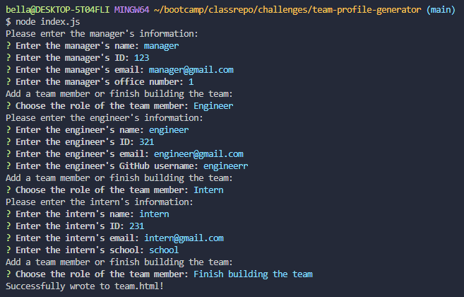

# Team Profile Generator

## Your Task

Based on user input, this command-line tool creates a webpage for the team profile. After the user enters details about the team manager, engineers, and interns, an HTML file displaying the information in a visually pleasing way is generated by the programme.

## Installation

To use this application, follow these steps:

1. Clone the repository to your local machine using `git clone`.
2. Navigate to the project directory.
3. Install dependencies by running `npm install`.

## Usage

After installing the dependencies, you can run the application by executing `node index.js` in your terminal. Complete the prompts to enter information about the team members. Once you've finished adding team members, the application will generate an HTML file in the `output` directory.

## Features

* Allows user to input information for a team manager, engineers, and interns.
* Validates user input to ensure it meets certain criteria (e.g., valid email addresses, non-empty fields).
* Generates a visually appealing HTML file displaying the team information.

## Dependencies

* `inquirer`: For prompting user input in the command line.
*  `path`: For working with file paths.
* `fs`: For interacting with the file system.

## References

* https://www.w3schools.com
* https://stackoverflow.com
* Xpert Learning Assistant